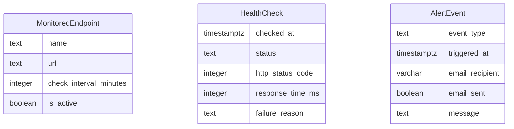

```mermaid
erDiagram
  MonitoredEndpoint {
    text name
    text url
    integer check_interval_minutes
    boolean is_active
  }
  HealthCheck {
    timestamptz checked_at
    text status
    integer http_status_code
    integer response_time_ms
    text failure_reason
  }
  AlertEvent {
    text event_type
    timestamptz triggered_at
    varchar email_recipient
    boolean email_sent
    text message
  }
```