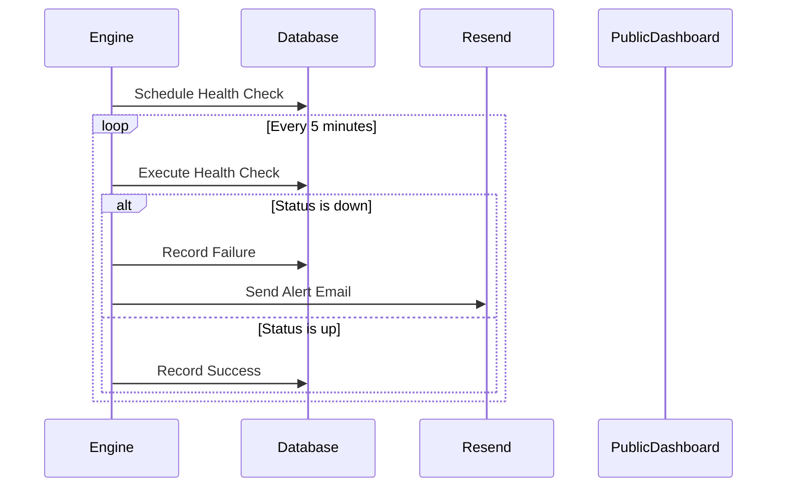
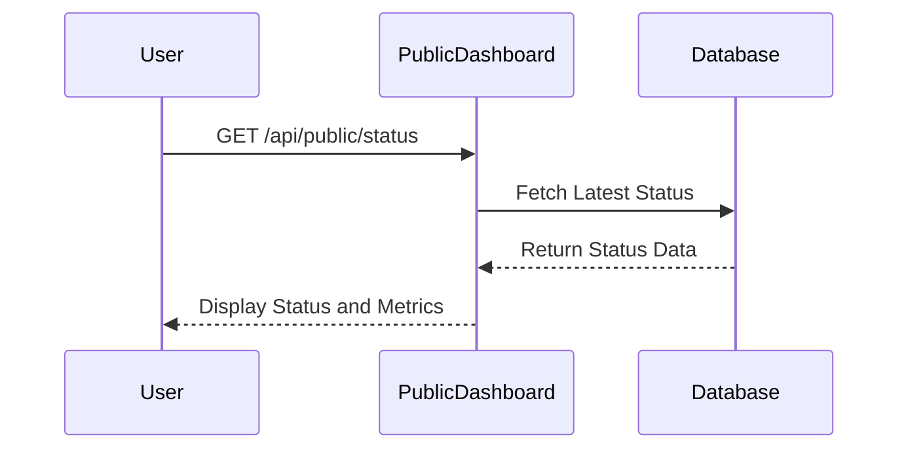

# Data Flows

## Health Check Execution

## Public Dashboard Access

These flows illustrate the periodic execution of health checks and how the public dashboard retrieves and displays the latest status information.