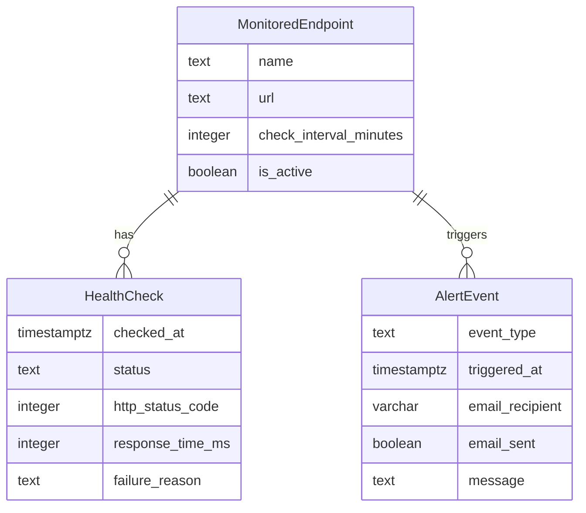

# Data Model

## Entity-Relationship Diagram

## Entity Descriptions
- **MonitoredEndpoint**: Represents a URL that is being monitored. Contains the name, URL, check interval, and active status.
- **HealthCheck**: Records the result of each check performed on a monitored endpoint, including the status, HTTP status code, response time, and any failure reason.
- **AlertEvent**: Logs events related to downtimes, including the type of event (e.g., downtime detected, recovery), the time it was triggered, the recipient of the alert email, and whether the email was sent.