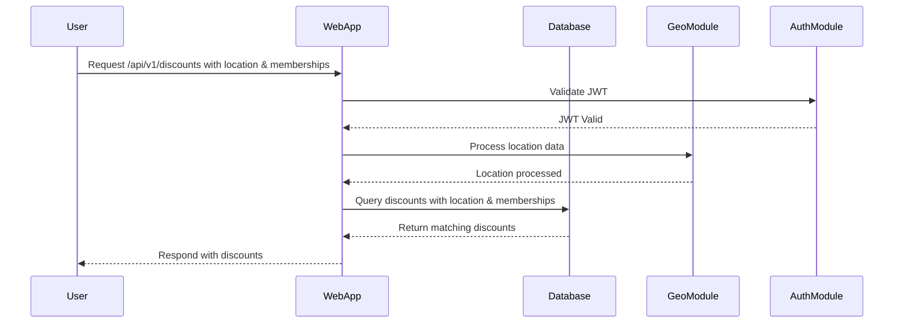

# Data Flows

## Key User/Data Flows

### Sequence Diagram for Discount Retrieval

This sequence diagram illustrates the flow of data when a user requests discounts based on their location and loyalty program memberships.