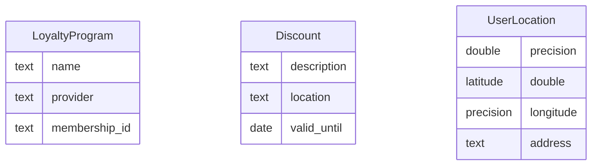

# Data Model

## ER Diagram

## Entity Descriptions

- **LoyaltyProgram**: Represents the loyalty programs available to users, including the name, provider, and unique membership ID.
- **Discount**: Details the discounts available, including a description, location, and expiration date.
- **UserLocation**: Captures the user's geographical data, including latitude, longitude, and address.