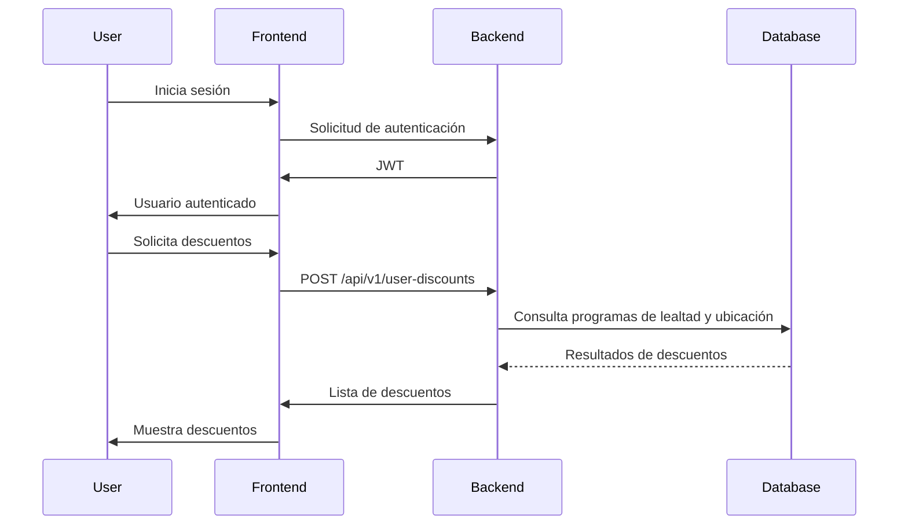

# Data Flows

## Key User/Data Flows

Este diagrama describe el flujo de datos desde que un usuario inicia sesión hasta que recibe una lista de descuentos basada en sus programas de lealtad y ubicación actual.