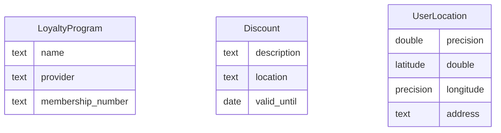

# Data Model

## ER Diagram

## Entities Description

- **LoyaltyProgram**: Representa un programa de lealtad específico que un usuario posee. Incluye el nombre del programa, el proveedor y el número de membresía.
- **Discount**: Detalla un descuento disponible, incluyendo su descripción, ubicación y fecha de validez.
- **UserLocation**: Captura la ubicación actual del usuario, especificando latitud, longitud y dirección.