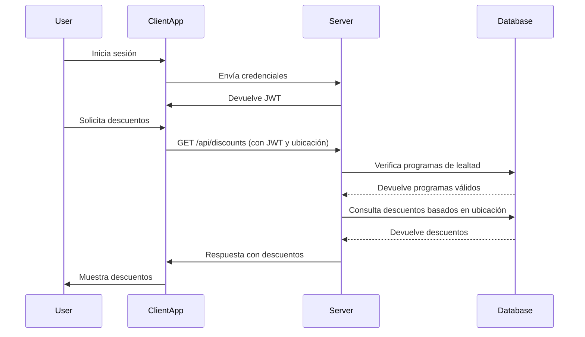

# Flujos de Datos en Descuentos Perú

## Diagrama de Secuencia: Solicitud de Descuentos

## Descripción del Flujo
1. **Inicio de Sesión**: El usuario inicia sesión y recibe un token JWT.
2. **Solicitud de Descuentos**: El cliente envía una solicitud al servidor con el token JWT y la ubicación del usuario.
3. **Validación de Programas**: El servidor verifica que el usuario tenga al menos un programa de lealtad válido.
4. **Consulta de Descuentos**: El servidor consulta la base de datos para obtener descuentos relevantes.
5. **Respuesta**: El servidor envía los descuentos al cliente, que los muestra al usuario.