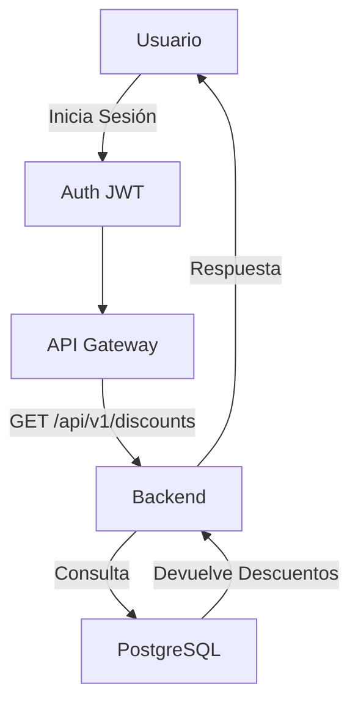

# Arquitectura de Descuentos Perú

## Visión General del Sistema
Descuentos Perú es una aplicación web que permite a los usuarios encontrar descuentos en restaurantes y tiendas cercanas basados en sus programas de lealtad y ubicación actual. El sistema está diseñado para integrarse con múltiples programas de lealtad peruanos y utiliza una arquitectura moderna basada en microservicios.

## Mapa de Componentes/Modulos
- **Geo Module**: Responsable de manejar la lógica relacionada con la geolocalización de los usuarios.
- **Growth Module**: Enfocado en las estrategias de crecimiento y retención de usuarios.

## Stack Tecnológico
- **Next.js 16**: Usado para el frontend, permitiendo una experiencia de usuario rápida y dinámica.
- **TypeScript**: Asegura tipado estático, mejorando la mantenibilidad del código.
- **PostgreSQL via Pooler**: Base de datos relacional para almacenar datos de programas de lealtad y descuentos.
- **Auth JWT**: Provee autenticación segura mediante tokens JWT.
- **Stripe**: Integración para pagos y suscripciones.
- **Resend**: Servicio para manejar el envío de correos electrónicos.
- **Fly.io**: Plataforma de despliegue para aplicaciones distribuidas.

## Flujo de Solicitudes
1. **Autenticación**: El usuario inicia sesión y obtiene un token JWT.
2. **Solicitud de Descuentos**: El usuario envía una solicitud GET a `/api/v1/discounts` con su ubicación y, opcionalmente, sus IDs de membresía.
3. **Procesamiento**: El backend valida la autenticación, verifica las membresías y consulta la base de datos para encontrar descuentos relevantes.
4. **Respuesta**: Se devuelve una lista de descuentos aplicables al usuario.

