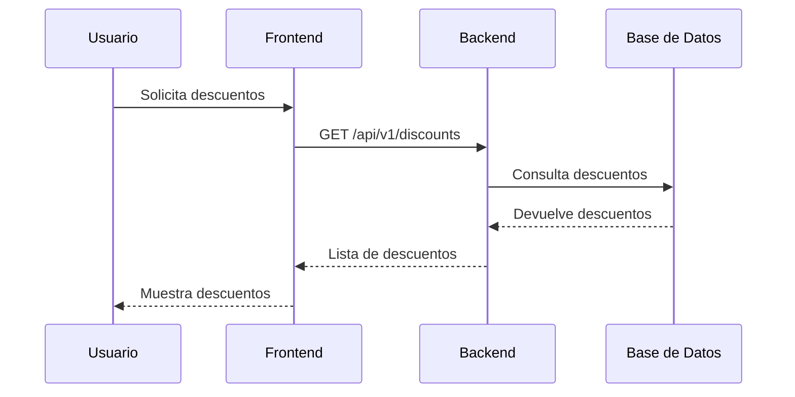
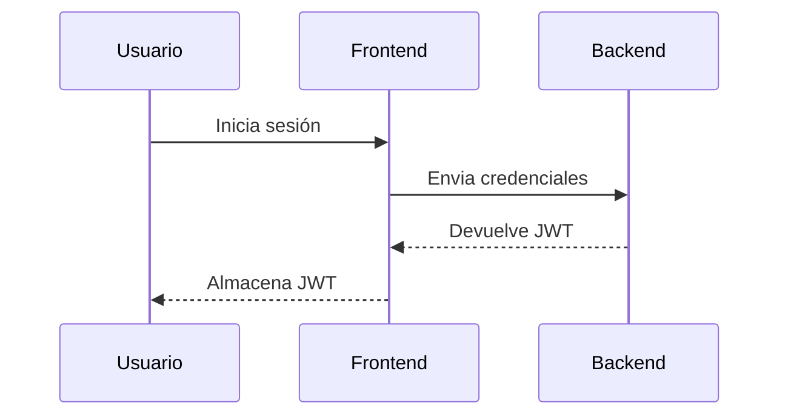

# Flujos de Datos Clave

## Flujo de Solicitud de Descuentos

```mermaid
sequenceDiagram
    participant U as Usuario
    participant FE as Frontend
    participant BE as Backend
    participant DB as Base de Datos

    U->>FE: Solicita descuentos
    FE->>BE: GET /api/v1/discounts
    BE->>DB: Consulta descuentos
    DB-->>BE: Devuelve descuentos
    BE-->>FE: Lista de descuentos
    FE-->>U: Muestra descuentos
```

## Flujo de Autenticación

```mermaid
sequenceDiagram
    participant U as Usuario
    participant FE as Frontend
    participant BE as Backend

    U->>FE: Inicia sesión
    FE->>BE: Envia credenciales
    BE-->>FE: Devuelve JWT
    FE-->>U: Almacena JWT
```
