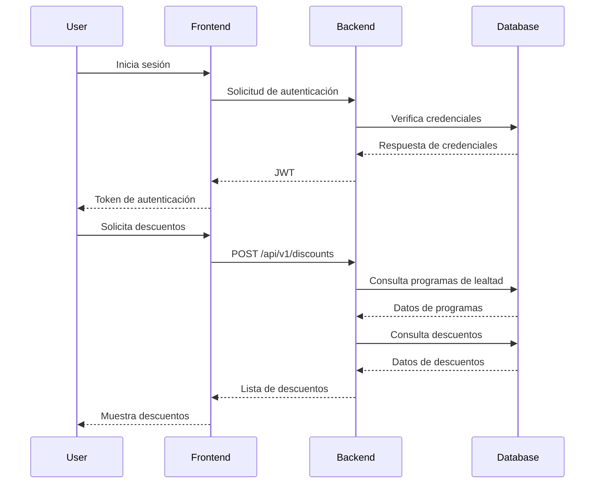

# Flujos de Datos

## Diagrama de Secuencia

```mermaid
sequenceDiagram
    participant User
    participant Frontend
    participant Backend
    participant Database

    User->>Frontend: Inicia sesión
    Frontend->>Backend: Solicitud de autenticación
    Backend->>Database: Verifica credenciales
    Database-->>Backend: Respuesta de credenciales
    Backend-->>Frontend: JWT
    Frontend-->>User: Token de autenticación

    User->>Frontend: Solicita descuentos
    Frontend->>Backend: POST /api/v1/discounts
    Backend->>Database: Consulta programas de lealtad
    Database-->>Backend: Datos de programas
    Backend->>Database: Consulta descuentos
    Database-->>Backend: Datos de descuentos
    Backend-->>Frontend: Lista de descuentos
    Frontend-->>User: Muestra descuentos
```
