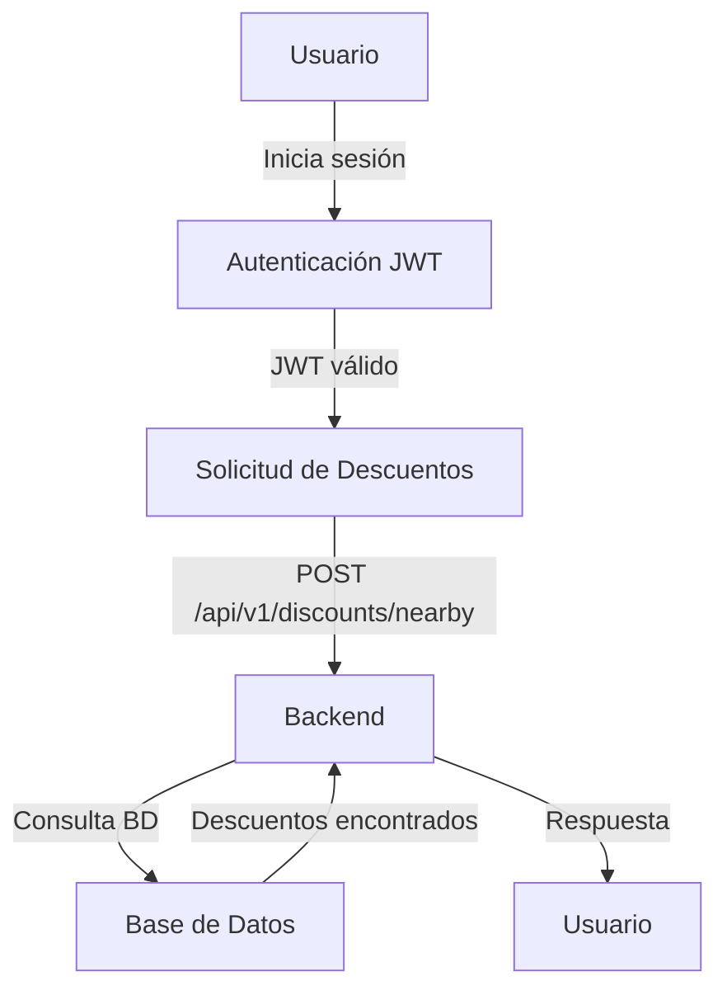

# Arquitectura de Descuentos Perú

## Descripción General del Sistema
Descuentos Perú es una aplicación web que permite a los usuarios encontrar descuentos en restaurantes y tiendas cercanas basándose en sus programas de lealtad y ubicación actual. La aplicación está construida utilizando el stack Puglit/TodoAstros, que incluye Next.js 16, TypeScript, PostgreSQL, y varios servicios externos como Stripe y Resend.

## Mapa de Componentes/Módulos
- **Frontend**: Implementado con Next.js 16 y TypeScript, proporciona la interfaz de usuario para que los usuarios interactúen con la aplicación.
- **Backend**: Implementado con Node.js y TypeScript, maneja la lógica de negocio, autenticación y comunicación con la base de datos.
- **Base de Datos**: PostgreSQL gestionado a través de un pooler para manejar conexiones eficientes.
- **Autenticación**: Implementada mediante JWT para asegurar las comunicaciones entre el cliente y el servidor.
- **Servicios Externos**: 
  - **Stripe**: Para manejar pagos y suscripciones.
  - **Resend**: Para el envío de correos electrónicos.
  - **Fly.io**: Para el despliegue de la aplicación.

## Stack y Justificación
- **Next.js 16**: Elegido por su capacidad para manejar aplicaciones React con renderizado del lado del servidor, mejorando el SEO y el tiempo de carga.
- **TypeScript**: Proporciona tipado estático, lo que ayuda a reducir errores en tiempo de desarrollo.
- **PostgreSQL**: Base de datos relacional robusta que soporta JSONB para almacenar datos de ubicación de manera eficiente.
- **JWT**: Proporciona un método seguro para transmitir información entre el cliente y el servidor.

## Flujo de Solicitudes
1. **Autenticación**: El usuario inicia sesión y se genera un JWT.
2. **Solicitud de Descuentos**: El cliente envía una solicitud POST a `/api/v1/discounts/nearby` con el JWT y la ubicación actual.
3. **Procesamiento en el Backend**: El servidor verifica el JWT, valida la solicitud y consulta la base de datos para encontrar descuentos relevantes.
4. **Respuesta**: El servidor responde con una lista de descuentos disponibles cerca de la ubicación del usuario.

