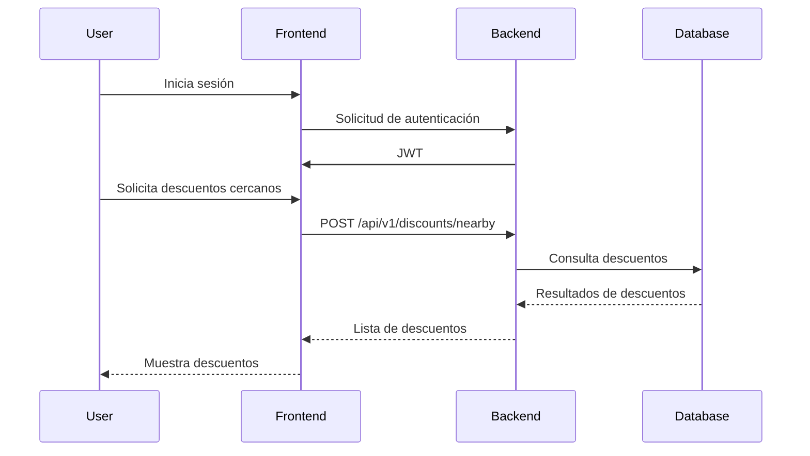

# Flujos de Datos

## Diagrama de Secuencia: Solicitud de Descuentos Cercanos

## Descripción del Flujo
1. El usuario inicia sesión en la aplicación, lo que genera un JWT que se almacena en el cliente.
2. El usuario solicita ver los descuentos cercanos a su ubicación actual.
3. El frontend envía una solicitud POST al backend con el JWT y la ubicación del usuario.
4. El backend verifica el JWT y consulta la base de datos para encontrar descuentos relevantes.
5. La base de datos devuelve los descuentos encontrados al backend.
6. El backend envía la lista de descuentos al frontend.
7. El frontend muestra los descuentos al usuario.
