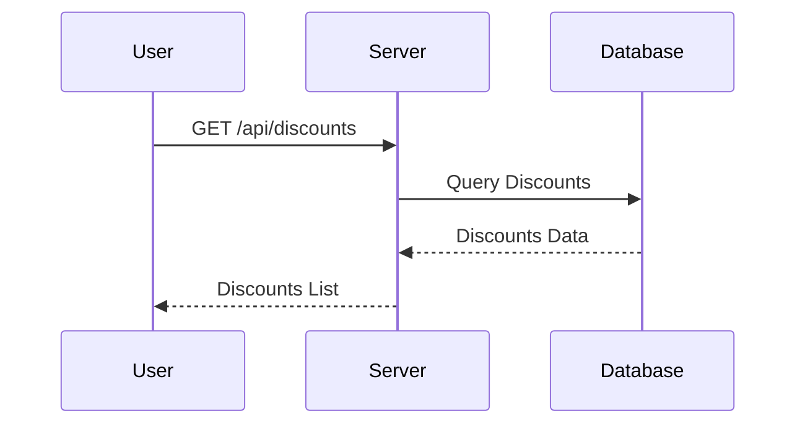

# Architecture

## System Overview
Descuentos Perú es una aplicación web que permite a los usuarios encontrar descuentos en restaurantes y tiendas cercanas basados en sus programas de lealtad activos y su ubicación actual. La aplicación utiliza scraping para obtener información actualizada de programas de lealtad de diversas entidades peruanas y presenta los descuentos disponibles al usuario.

## Component/Module Map
- **Next.js 16**: Framework para el frontend y el backend del servidor.
- **TypeScript**: Lenguaje de programación utilizado para asegurar tipado estático.
- **PostgreSQL**: Base de datos relacional utilizada para almacenar datos de programas de lealtad, descuentos y ubicaciones de usuarios.
- **JWT (JSON Web Tokens)**: Utilizado para la autenticación de usuarios.
- **Stripe**: Integrado para posibles futuras funcionalidades de pago.
- **Resend**: Servicio para el envío de correos electrónicos.
- **Fly.io**: Plataforma de despliegue para la aplicación.

## Stack and Why
- **Next.js**: Elegido por su capacidad de renderizado del lado del servidor y su integración con React, lo que mejora la experiencia del usuario.
- **TypeScript**: Proporciona seguridad de tipos, lo que reduce errores en tiempo de ejecución.
- **PostgreSQL**: Ofrece robustez y flexibilidad para manejar relaciones complejas entre entidades.
- **JWT**: Proporciona un método seguro y estándar para la autenticación de usuarios.

## How Requests Flow
1. **Usuario inicia sesión**: El usuario se autentica mediante JWT.
2. **Solicitud de descuentos**: El usuario envía una solicitud GET a `/api/discounts` con su ubicación actual y, opcionalmente, sus programas de lealtad activos.
3. **Procesamiento del servidor**: El servidor verifica la autenticación, valida los parámetros y consulta la base de datos para obtener descuentos relevantes.
4. **Respuesta**: Se devuelve una lista de descuentos aplicables al usuario.

