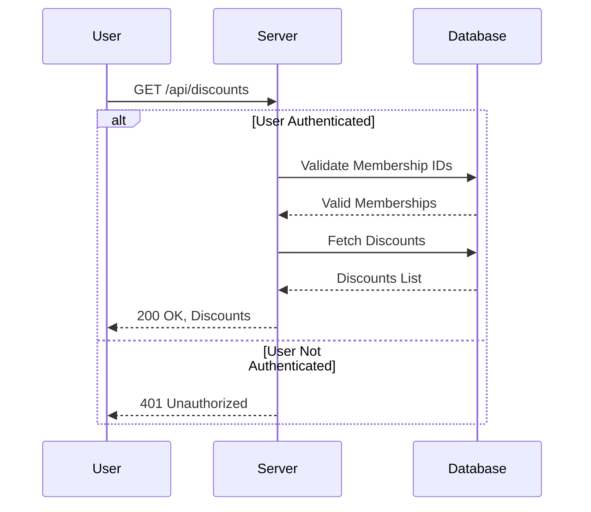
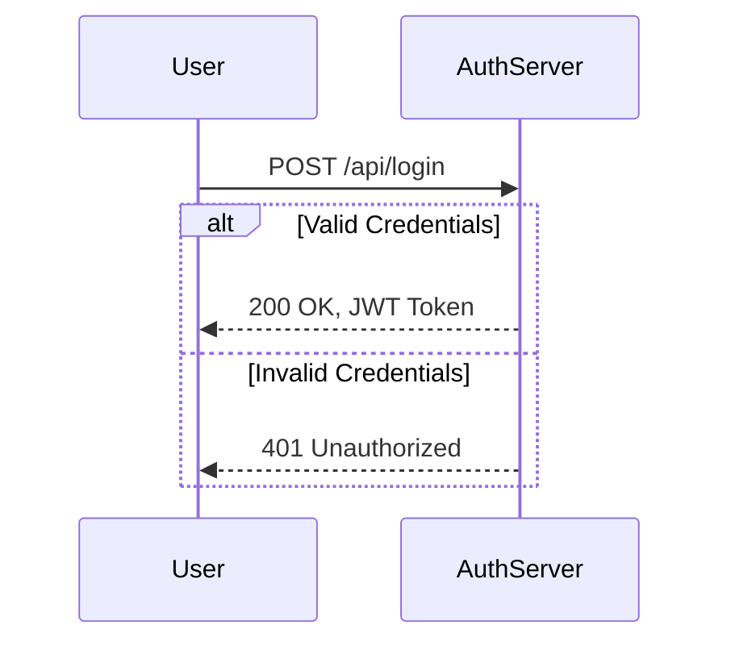

# Data Flows

## Key User/Data Flows

### User Requests Discounts

```mermaid
sequenceDiagram
    participant User
    participant Server
    participant Database
    User->>Server: GET /api/discounts
    alt User Authenticated
        Server->>Database: Validate Membership IDs
        Database-->>Server: Valid Memberships
        Server->>Database: Fetch Discounts
        Database-->>Server: Discounts List
        Server-->>User: 200 OK, Discounts
    else User Not Authenticated
        Server-->>User: 401 Unauthorized
    end
```

### User Logs In

```mermaid
sequenceDiagram
    participant User
    participant AuthServer
    User->>AuthServer: POST /api/login
    alt Valid Credentials
        AuthServer-->>User: 200 OK, JWT Token
    else Invalid Credentials
        AuthServer-->>User: 401 Unauthorized
    end
```
