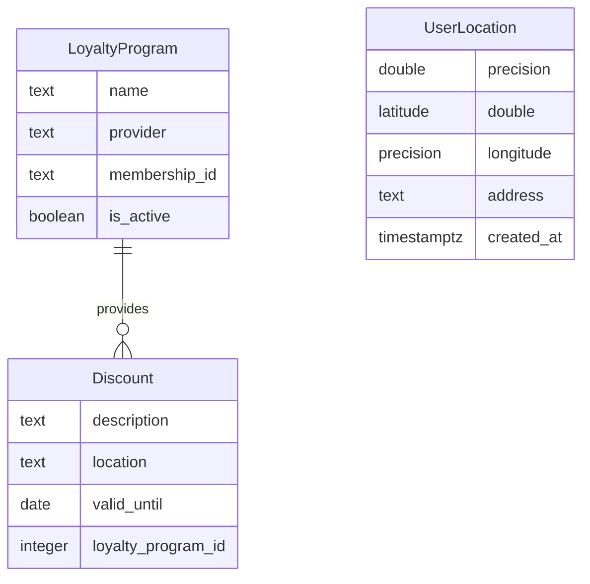

# Data Model

## ER Diagram

## Entity Descriptions

### LoyaltyProgram
- **name**: Nombre del programa de lealtad.
- **provider**: Proveedor del programa de lealtad.
- **membership_id**: Identificador único del miembro dentro del programa.
- **is_active**: Indica si el programa está activo para el usuario.

### Discount
- **description**: Descripción del descuento.
- **location**: Ubicación donde el descuento es aplicable.
- **valid_until**: Fecha hasta la cual el descuento es válido.
- **loyalty_program_id**: Referencia al programa de lealtad asociado.

### UserLocation
- **latitude**: Latitud de la ubicación del usuario.
- **longitude**: Longitud de la ubicación del usuario.
- **address**: Dirección textual de la ubicación del usuario.
- **created_at**: Fecha y hora de creación del registro de ubicación.
