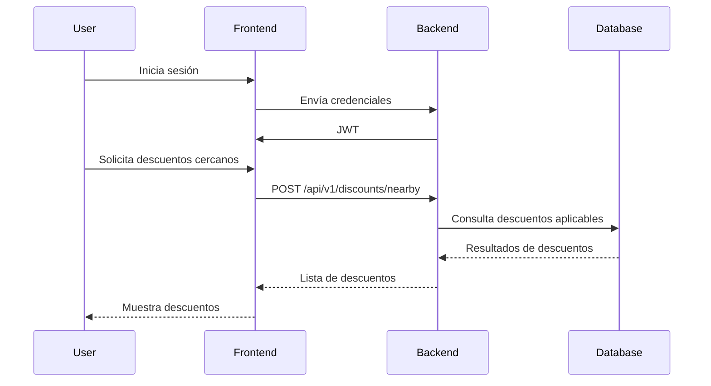
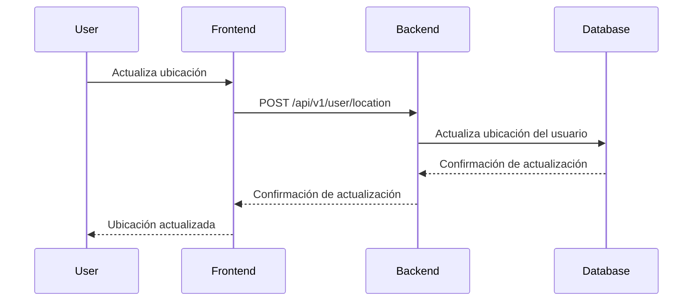

# Flujos de Datos

## Diagrama de Secuencia: Solicitud de Descuentos Cercanos

```mermaid
sequenceDiagram
    participant User
    participant Frontend
    participant Backend
    participant Database

    User->>Frontend: Inicia sesión
    Frontend->>Backend: Envía credenciales
    Backend->>Frontend: JWT
    User->>Frontend: Solicita descuentos cercanos
    Frontend->>Backend: POST /api/v1/discounts/nearby
    Backend->>Database: Consulta descuentos aplicables
    Database-->>Backend: Resultados de descuentos
    Backend-->>Frontend: Lista de descuentos
    Frontend-->>User: Muestra descuentos
```

## Diagrama de Secuencia: Actualización de Ubicación del Usuario

```mermaid
sequenceDiagram
    participant User
    participant Frontend
    participant Backend
    participant Database

    User->>Frontend: Actualiza ubicación
    Frontend->>Backend: POST /api/v1/user/location
    Backend->>Database: Actualiza ubicación del usuario
    Database-->>Backend: Confirmación de actualización
    Backend-->>Frontend: Confirmación de actualización
    Frontend-->>User: Ubicación actualizada
```