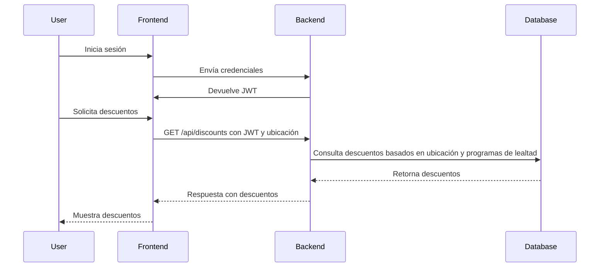

# Flujos de Datos Clave

## Flujo de Descuentos

```mermaid
sequenceDiagram
    participant User
    participant Frontend
    participant Backend
    participant Database

    User->>Frontend: Inicia sesión
    Frontend->>Backend: Envía credenciales
    Backend->>Frontend: Devuelve JWT
    User->>Frontend: Solicita descuentos
    Frontend->>Backend: GET /api/discounts con JWT y ubicación
    Backend->>Database: Consulta descuentos basados en ubicación y programas de lealtad
    Database-->>Backend: Retorna descuentos
    Backend-->>Frontend: Respuesta con descuentos
    Frontend-->>User: Muestra descuentos
```

Este diagrama ilustra cómo un usuario interactúa con la aplicación para obtener descuentos basados en su ubicación y programas de lealtad.