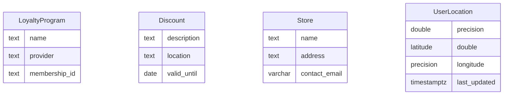

# Modelo de Datos

## Diagrama ER

## Descripción de Entidades y Relaciones
- **LoyaltyProgram**: Representa un programa de lealtad al que un usuario puede estar suscrito. Incluye el nombre del programa, el proveedor y un ID de membresía.
- **Discount**: Detalla un descuento disponible, incluyendo su descripción, ubicación y fecha de validez.
- **Store**: Información sobre las tiendas que ofrecen descuentos, incluyendo nombre, dirección y correo de contacto.
- **UserLocation**: Almacena la ubicación actual del usuario, con latitud, longitud y la última actualización.