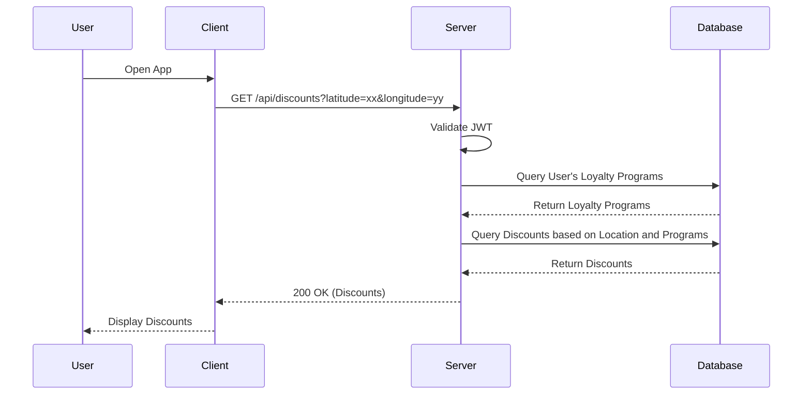

# Data Flows

## Key User/Data Flows

### User Requests Discounts

This flow demonstrates how a user interacts with the application to receive personalized discounts based on their location and loyalty programs.