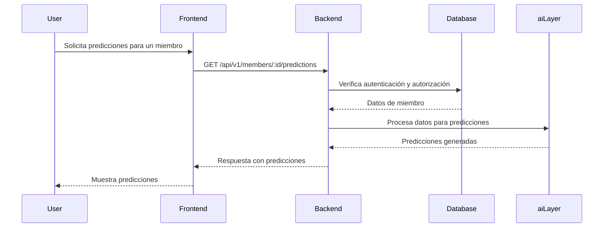
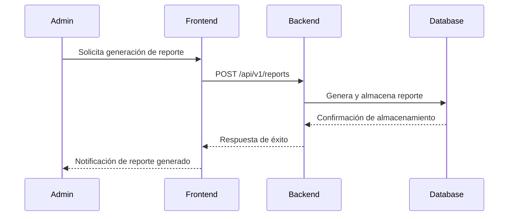

# Flujos de Datos en Fitlytics

## Diagrama de Secuencia para Predicciones de Miembros

```mermaid
sequenceDiagram
    participant User
    participant Frontend
    participant Backend
    participant Database
    participant aiLayer

    User->>Frontend: Solicita predicciones para un miembro
    Frontend->>Backend: GET /api/v1/members/:id/predictions
    Backend->>Database: Verifica autenticación y autorización
    Database-->>Backend: Datos de miembro
    Backend->>aiLayer: Procesa datos para predicciones
    aiLayer-->>Backend: Predicciones generadas
    Backend-->>Frontend: Respuesta con predicciones
    Frontend-->>User: Muestra predicciones
```

## Diagrama de Secuencia para Generación de Reportes

```mermaid
sequenceDiagram
    participant Admin
    participant Frontend
    participant Backend
    participant Database

    Admin->>Frontend: Solicita generación de reporte
    Frontend->>Backend: POST /api/v1/reports
    Backend->>Database: Genera y almacena reporte
    Database-->>Backend: Confirmación de almacenamiento
    Backend-->>Frontend: Respuesta de éxito
    Frontend-->>Admin: Notificación de reporte generado
```