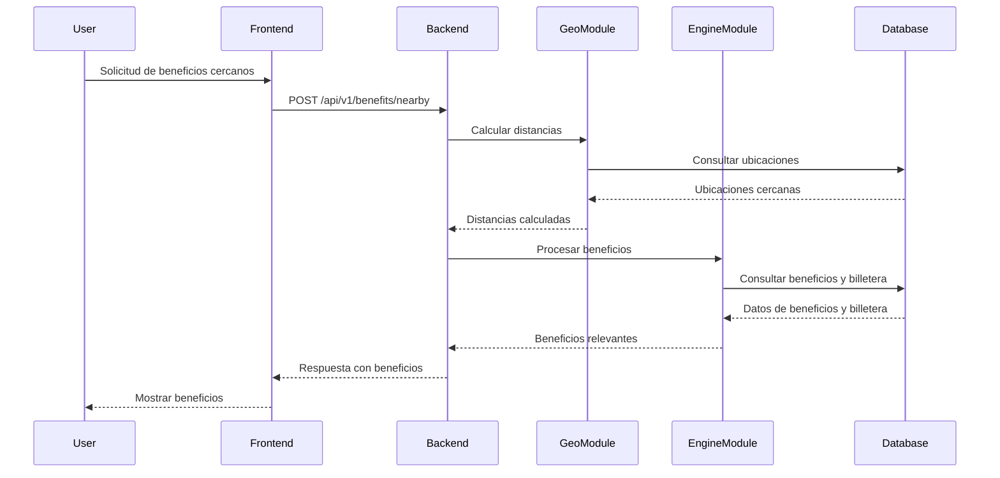

# Flujos de Datos

## Diagrama de Secuencia: Solicitud de Beneficios Cercanos

Este flujo describe cómo un usuario interactúa con la aplicación para obtener beneficios cercanos basados en su ubicación y "Mi Billetera".