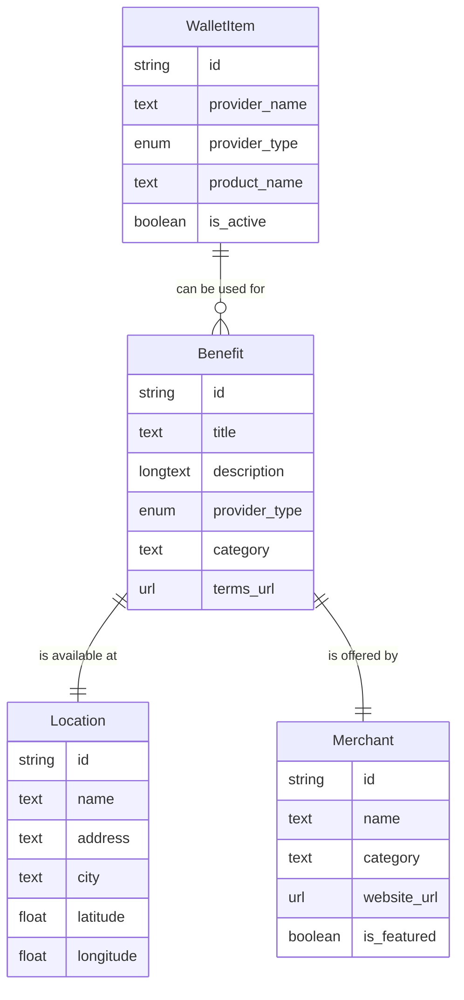

# Modelo de Datos

## Diagrama ER

## Descripción de Entidades y Relaciones

- **Benefit**: Representa un descuento o beneficio disponible. Está asociado a una ubicación y un comerciante.
- **Location**: Detalla la ubicación física donde un beneficio está disponible.
- **WalletItem**: Representa un producto de "Mi Billetera" del usuario, como una tarjeta de crédito o un plan telefónico.
- **Merchant**: Representa al comerciante que ofrece el beneficio.

Las relaciones entre estas entidades permiten determinar qué beneficios están disponibles en qué ubicaciones y cuáles son aplicables a los elementos de la billetera del usuario.