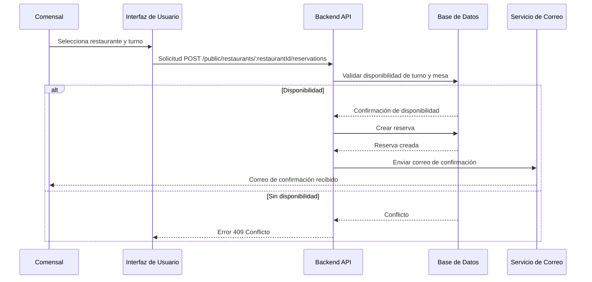

# Flujos de Datos

## Diagrama de Secuencia: Creación de Reserva

Este diagrama muestra el flujo de datos desde que un comensal intenta realizar una reserva hasta que recibe una confirmación por correo electrónico.