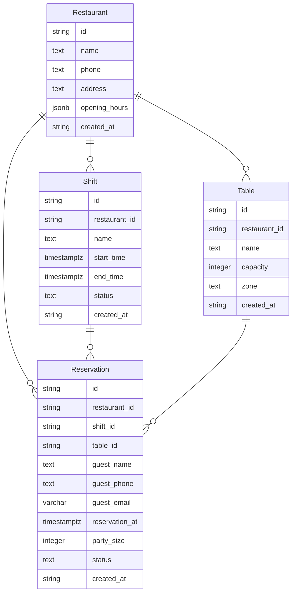

# Modelo de Datos

## Diagrama ER

## Descripción de Entidades y Relaciones

- **Restaurant**: Representa un restaurante con sus detalles de contacto y horarios de apertura.
- **Table**: Define las mesas disponibles en un restaurante, incluyendo su capacidad y zona.
- **Shift**: Describe un turno operativo de un restaurante, con un estado que puede ser "draft", "open" o "closed".
- **Reservation**: Detalla una reserva realizada por un comensal, incluyendo información de contacto y el turno reservado.

Las relaciones entre las entidades permiten gestionar las reservas en función de la disponibilidad de mesas y turnos en un restaurante.