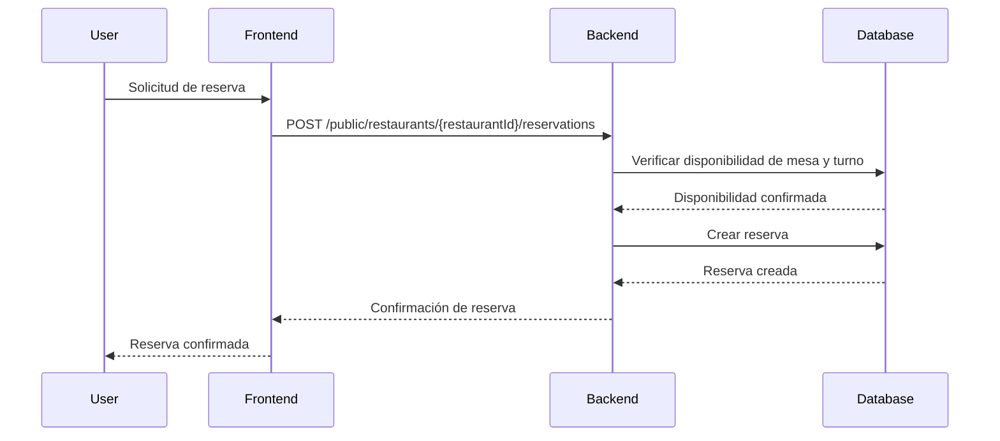
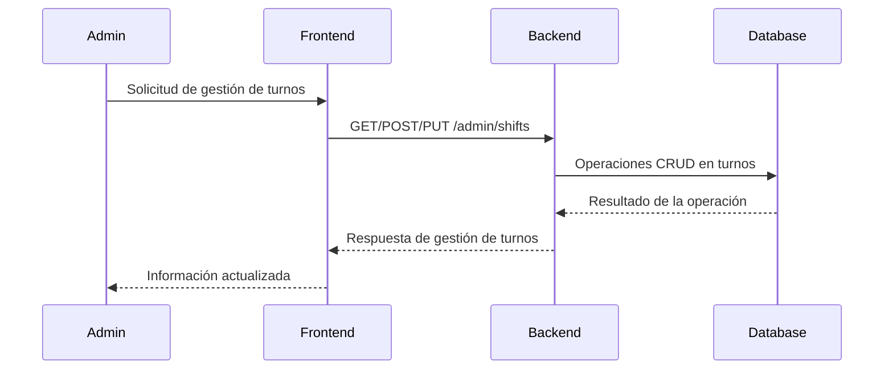

# Flujos de Datos

## Diagrama de Secuencia: Creación de Reserva

```mermaid
sequenceDiagram
    participant User
    participant Frontend
    participant Backend
    participant Database
    User->>Frontend: Solicitud de reserva
    Frontend->>Backend: POST /public/restaurants/{restaurantId}/reservations
    Backend->>Database: Verificar disponibilidad de mesa y turno
    Database-->>Backend: Disponibilidad confirmada
    Backend->>Database: Crear reserva
    Database-->>Backend: Reserva creada
    Backend-->>Frontend: Confirmación de reserva
    Frontend-->>User: Reserva confirmada
```

## Diagrama de Secuencia: Gestión de Turnos

```mermaid
sequenceDiagram
    participant Admin
    participant Frontend
    participant Backend
    participant Database
    Admin->>Frontend: Solicitud de gestión de turnos
    Frontend->>Backend: GET/POST/PUT /admin/shifts
    Backend->>Database: Operaciones CRUD en turnos
    Database-->>Backend: Resultado de la operación
    Backend-->>Frontend: Respuesta de gestión de turnos
    Frontend-->>Admin: Información actualizada
```