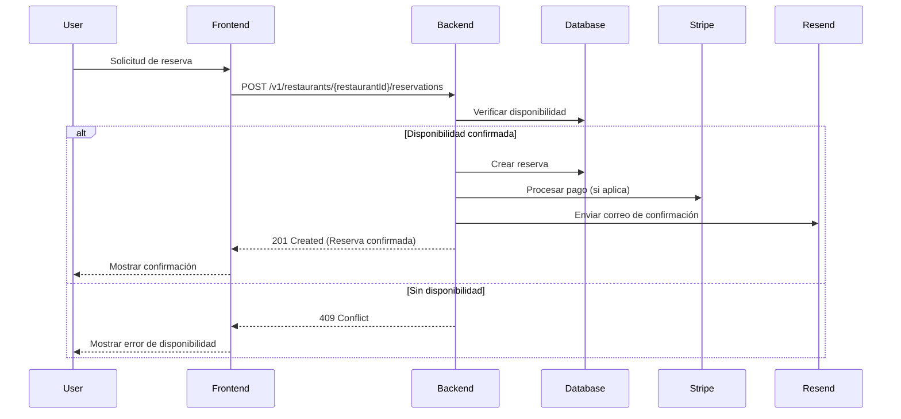

# Flujos de Datos en Mesa

## Diagrama de Secuencia: Creación de Reserva

Este diagrama describe el flujo de datos desde que un usuario intenta realizar una reserva hasta que recibe una confirmación o un mensaje de error.