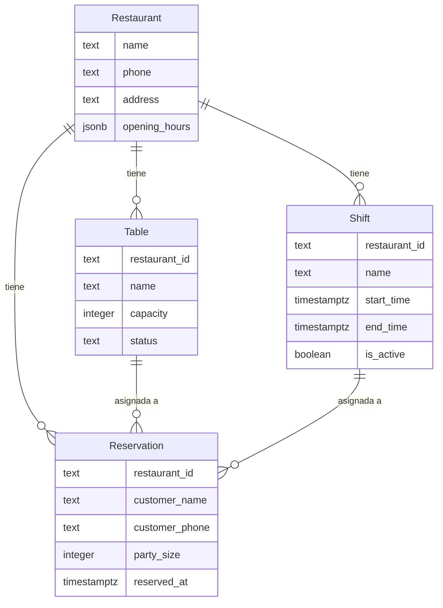

# Modelo de Datos de Mesa

## Diagrama ER

## Descripción de Entidades y Relaciones
- **Restaurant**: Representa un restaurante con sus datos de contacto y horarios de apertura.
- **Table**: Mesas disponibles en un restaurante, con capacidad y estado.
- **Reservation**: Detalles de una reserva, incluyendo cliente, tamaño del grupo y hora reservada.
- **Shift**: Turnos de operación de un restaurante, indicando si están activos.

Las relaciones muestran que un restaurante puede tener múltiples mesas, turnos y reservas. Las reservas están asociadas a mesas y turnos específicos.