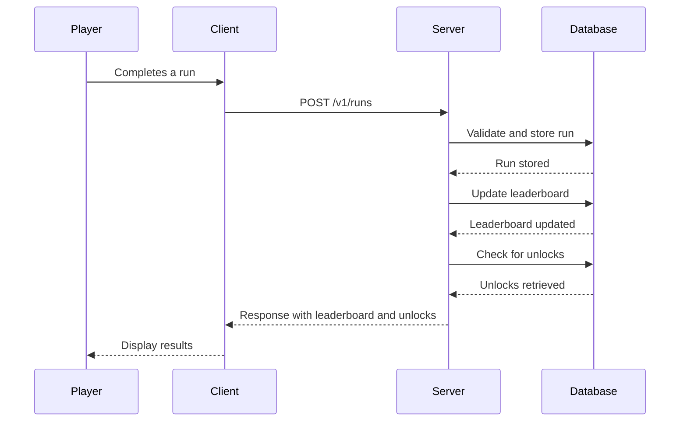
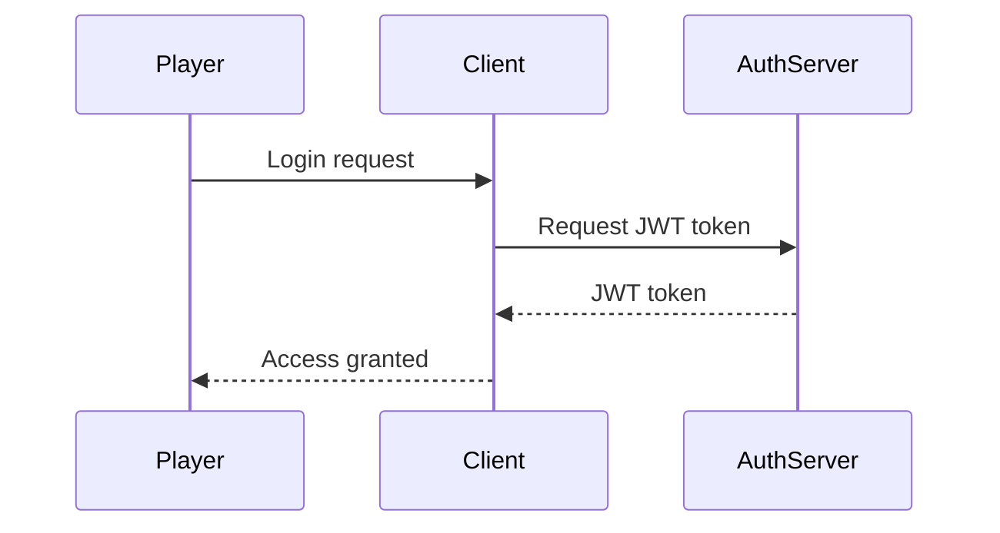
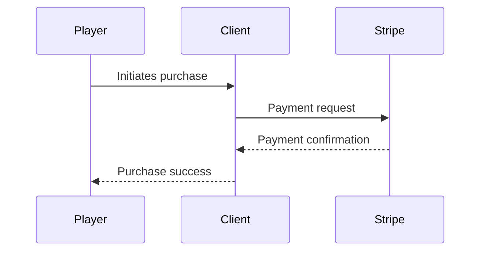

# NeonJump Data Flows

## Key User/Data Flows

### Run Submission Flow

```mermaid
sequenceDiagram
    participant Player
    participant Client
    participant Server
    participant Database

    Player->>Client: Completes a run
    Client->>Server: POST /v1/runs
    Server->>Database: Validate and store run
    Database-->>Server: Run stored
    Server->>Database: Update leaderboard
    Database-->>Server: Leaderboard updated
    Server->>Database: Check for unlocks
    Database-->>Server: Unlocks retrieved
    Server-->>Client: Response with leaderboard and unlocks
    Client-->>Player: Display results
```

### Authentication Flow

```mermaid
sequenceDiagram
    participant Player
    participant Client
    participant AuthServer

    Player->>Client: Login request
    Client->>AuthServer: Request JWT token
    AuthServer-->>Client: JWT token
    Client-->>Player: Access granted
```

### Payment Flow (Stripe)

```mermaid
sequenceDiagram
    participant Player
    participant Client
    participant Stripe

    Player->>Client: Initiates purchase
    Client->>Stripe: Payment request
    Stripe-->>Client: Payment confirmation
    Client-->>Player: Purchase success
```