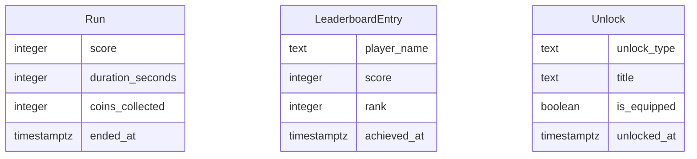

# NeonJump Data Model

## Entity-Relationship Diagram

## Entity Descriptions

### Run
- **score**: The player's score for the run.
- **duration_seconds**: The duration of the run in seconds.
- **coins_collected**: Number of coins collected during the run.
- **ended_at**: Timestamp when the run ended.

### LeaderboardEntry
- **player_name**: The name of the player.
- **score**: The score achieved by the player.
- **rank**: The player's rank on the leaderboard.
- **achieved_at**: Timestamp when the score was achieved.

### Unlock
- **unlock_type**: Type of unlock (e.g., skin, character, trail, badge).
- **title**: Title of the unlock.
- **is_equipped**: Whether the unlock is currently equipped.
- **unlocked_at**: Timestamp when the unlock was achieved.