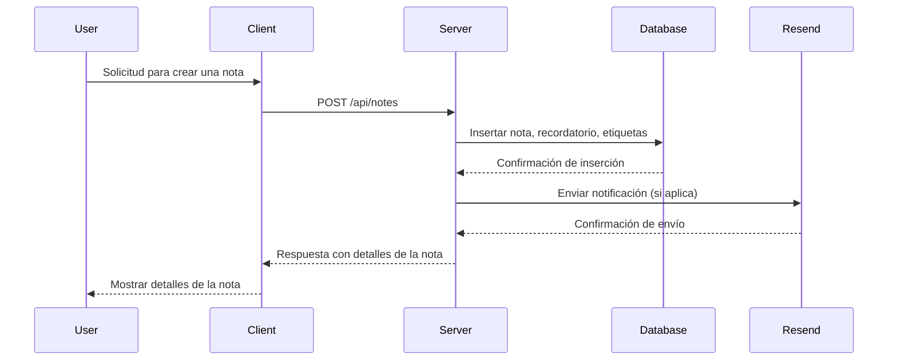

# Flujos de Datos

## Diagrama de Secuencia para Crear una Nota

```mermaid
sequenceDiagram
    participant User
    participant Client
    participant Server
    participant Database
    participant Resend

    User->>Client: Solicitud para crear una nota
    Client->>Server: POST /api/notes
    Server->>Database: Insertar nota, recordatorio, etiquetas
    Database-->>Server: Confirmación de inserción
    Server->>Resend: Enviar notificación (si aplica)
    Resend-->>Server: Confirmación de envío
    Server-->>Client: Respuesta con detalles de la nota
    Client-->>User: Mostrar detalles de la nota
```