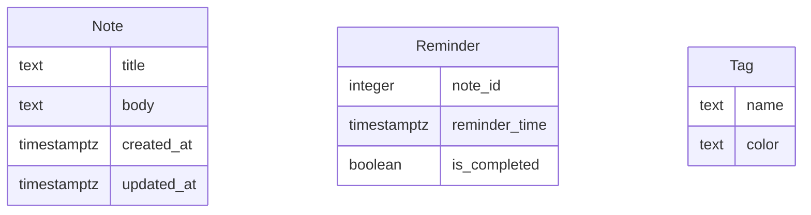

# Modelo de Datos

## Diagrama ER

## Descripción de Entidades y Relaciones
- **Note**: Representa una nota creada por el usuario. Contiene un título, cuerpo, y marcas de tiempo de creación y actualización.
- **Reminder**: Asociado a una nota, especifica un tiempo de recordatorio y si ha sido completado.
- **Tag**: Etiquetas que pueden ser asociadas a notas para categorizarlas. Incluye un nombre y un color.
- **Relaciones**:
  - Una **Note** puede tener múltiples **Reminders**.
  - Una **Note** puede tener múltiples **Tags**.