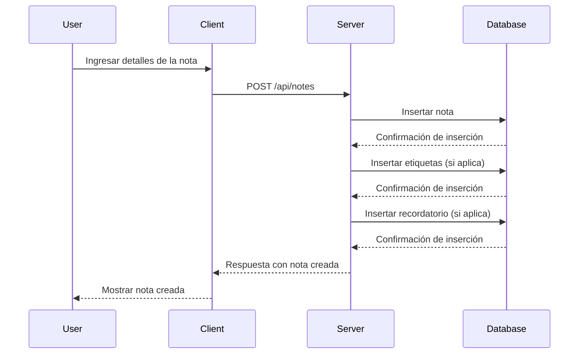
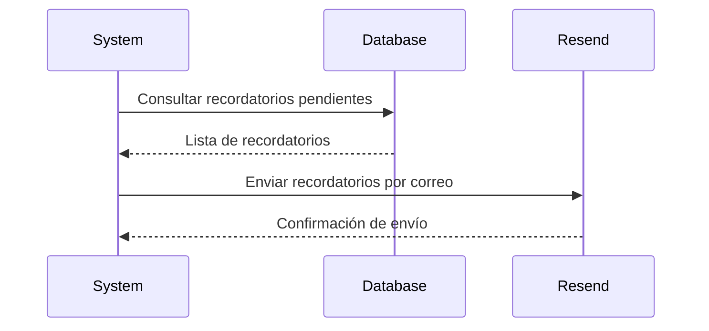

# Flujos de Datos Clave

## Diagrama de Secuencia: Creación de Nota

```mermaid
sequenceDiagram
    participant User
    participant Client
    participant Server
    participant Database
    User->>Client: Ingresar detalles de la nota
    Client->>Server: POST /api/notes
    Server->>Database: Insertar nota
    Database-->>Server: Confirmación de inserción
    Server->>Database: Insertar etiquetas (si aplica)
    Database-->>Server: Confirmación de inserción
    Server->>Database: Insertar recordatorio (si aplica)
    Database-->>Server: Confirmación de inserción
    Server-->>Client: Respuesta con nota creada
    Client-->>User: Mostrar nota creada
```

## Diagrama de Secuencia: Recordatorio

```mermaid
sequenceDiagram
    participant System
    participant Database
    participant Resend
    System->>Database: Consultar recordatorios pendientes
    Database-->>System: Lista de recordatorios
    System->>Resend: Enviar recordatorios por correo
    Resend-->>System: Confirmación de envío
```
