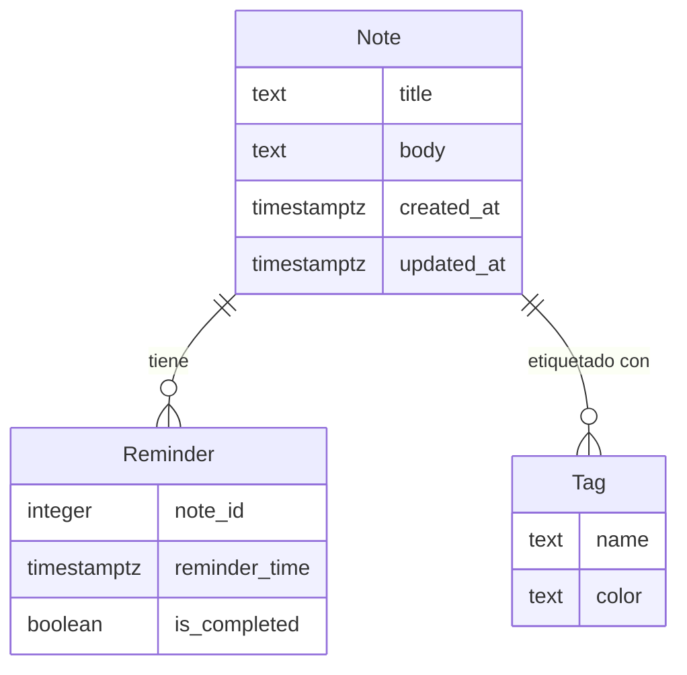

# Modelo de Datos

## Diagrama ER

## Descripción de Entidades y Relaciones

- **Note**: Representa una nota creada por un usuario. Contiene un título, cuerpo, y marcas de tiempo de creación y actualización.
- **Reminder**: Asociado a una nota, indica un recordatorio con una hora específica y un estado de completado.
- **Tag**: Representa una etiqueta que puede ser asociada a una o más notas, con un nombre y un color para identificación visual.
- **Relaciones**:
  - Una **Note** puede tener múltiples **Reminders**.
  - Una **Note** puede estar asociada a múltiples **Tags**.
