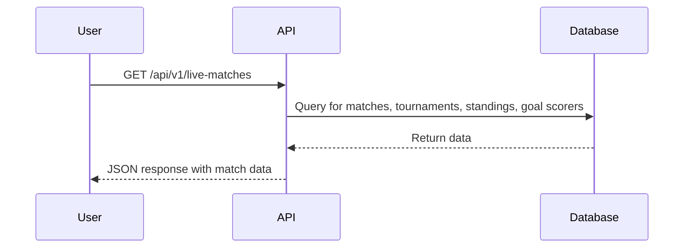
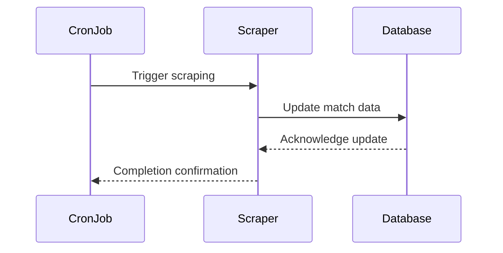

# Data Flows

## Live Match Data Flow

```mermaid
sequenceDiagram
    participant User
    participant API
    participant Database
    User->>API: GET /api/v1/live-matches
    API->>Database: Query for matches, tournaments, standings, goal scorers
    Database-->>API: Return data
    API-->>User: JSON response with match data
```

## Data Scraping and Update Flow

```mermaid
sequenceDiagram
    participant CronJob
    participant Scraper
    participant Database
    CronJob->>Scraper: Trigger scraping
    Scraper->>Database: Update match data
    Database-->>Scraper: Acknowledge update
    Scraper-->>CronJob: Completion confirmation
```