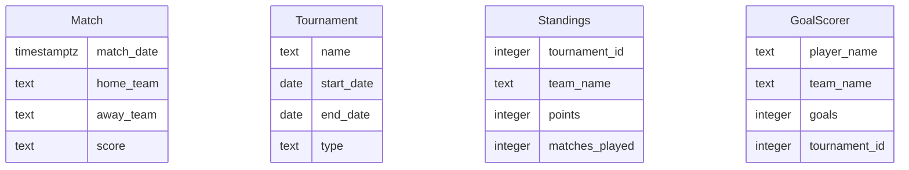

# Data Model

## Entity-Relationship Diagram

## Entity Descriptions
- **Match**: Represents a football match with details on the date, teams involved, and score.
- **Tournament**: Contains information about a football tournament, including its name, duration, and type (league, cup, friendly).
- **Standings**: Tracks the performance of teams in a tournament, including points and matches played.
- **GoalScorer**: Records the top goal scorers in a tournament, associating players with their teams and goal counts.