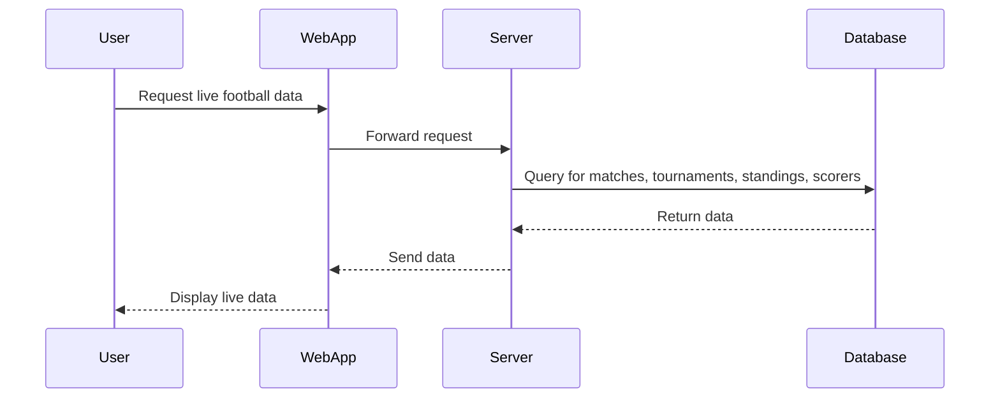
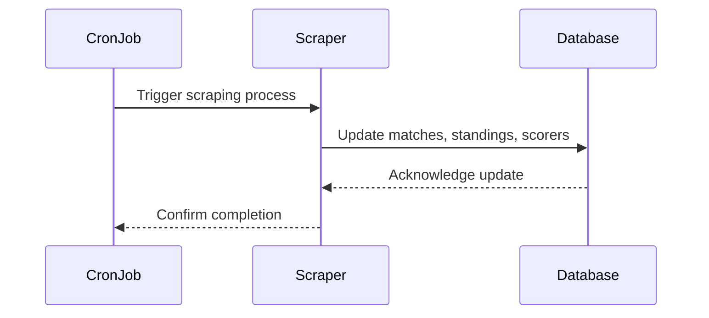

# Flujos de Datos

## Diagrama de Secuencia: Consulta de Datos en Vivo

```mermaid
sequenceDiagram
    participant User
    participant WebApp
    participant Server
    participant Database
    User->>WebApp: Request live football data
    WebApp->>Server: Forward request
    Server->>Database: Query for matches, tournaments, standings, scorers
    Database-->>Server: Return data
    Server-->>WebApp: Send data
    WebApp-->>User: Display live data
```

## Diagrama de Secuencia: Actualización de Datos por Cron

```mermaid
sequenceDiagram
    participant CronJob
    participant Scraper
    participant Database
    CronJob->>Scraper: Trigger scraping process
    Scraper->>Database: Update matches, standings, scorers
    Database-->>Scraper: Acknowledge update
    Scraper-->>CronJob: Confirm completion
```