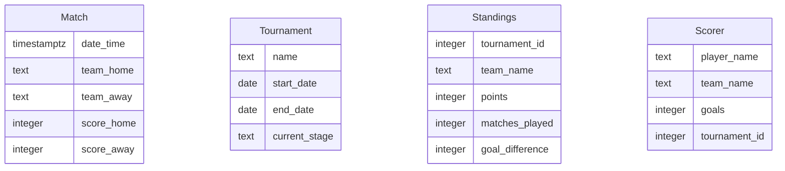

# Modelo de Datos

## Diagrama ER

## Descripción de Entidades y Relaciones
- **Match**: Representa un partido de fútbol con equipos locales y visitantes, y sus respectivos puntajes.
- **Tournament**: Define un torneo de fútbol, incluyendo su nombre, fechas de inicio y fin, y la etapa actual.
- **Standings**: Almacena la posición de un equipo en un torneo específico, con puntos, partidos jugados y diferencia de goles.
- **Scorer**: Registra los goleadores de un torneo, incluyendo el nombre del jugador, equipo y goles anotados.

### Relaciones
- **Match** está relacionado con **Tournament** a través de los equipos que participan en los partidos.
- **Standings** y **Scorer** están vinculados a **Tournament** mediante el `tournament_id` para identificar el torneo correspondiente.