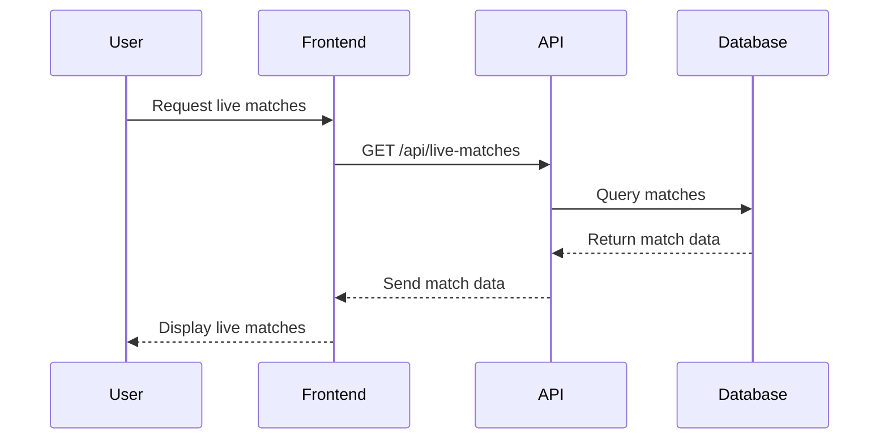
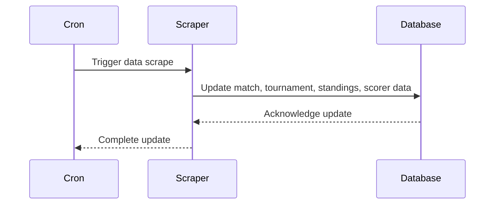

# Data Flows

## Key User/Data Flows

### Live Match Data Retrieval

```mermaid
sequenceDiagram
    participant User
    participant Frontend
    participant API
    participant Database

    User->>Frontend: Request live matches
    Frontend->>API: GET /api/live-matches
    API->>Database: Query matches
    Database-->>API: Return match data
    API-->>Frontend: Send match data
    Frontend-->>User: Display live matches
```

### Data Scraping and Update

```mermaid
sequenceDiagram
    participant Cron
    participant Scraper
    participant Database

    Cron->>Scraper: Trigger data scrape
    Scraper->>Database: Update match, tournament, standings, scorer data
    Database-->>Scraper: Acknowledge update
    Scraper-->>Cron: Complete update
```