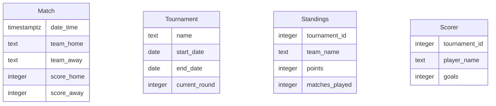

# Data Model

## ER Diagram

## Entity Descriptions
- **Match**: Represents a football match with details such as date, teams involved, and scores.
- **Tournament**: Contains information about a football tournament, including its name, duration, and current round.
- **Standings**: Tracks the standings of teams in a tournament, including points and matches played.
- **Scorer**: Records the top scorers in a tournament, detailing player names and goals scored.

## Relationships
- **Match** is related to **Tournament** through the tournament's matches.
- **Standings** and **Scorer** are linked to **Tournament** via the tournament_id, indicating their association with specific tournaments.