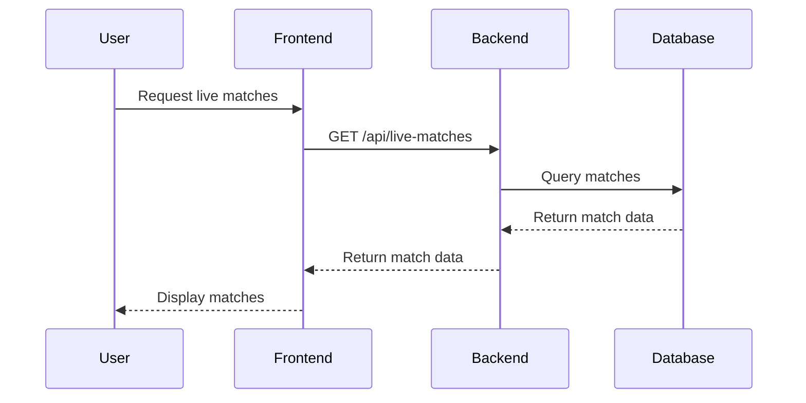
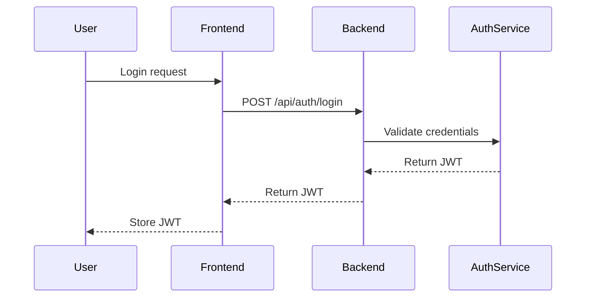
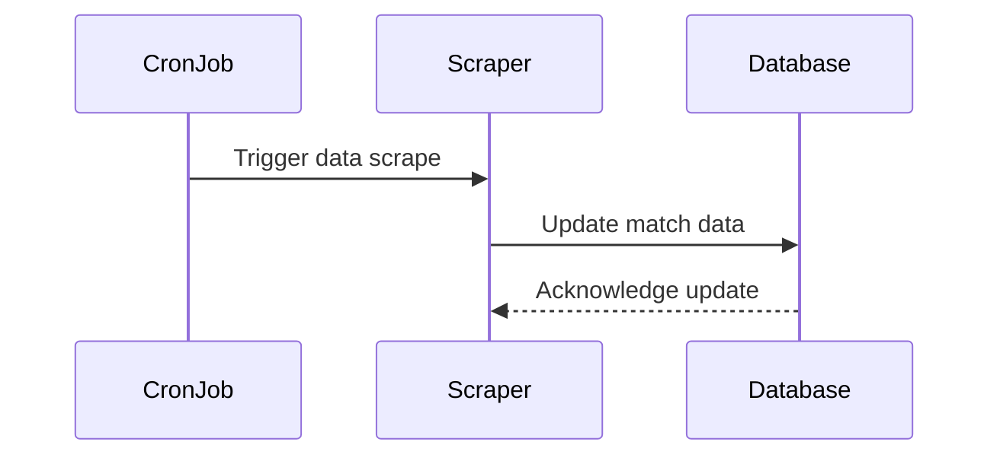

# Data Flows

## Key User/Data Flows

### Live Match Retrieval

### Authentication Flow

### Data Scraping and Update

These flows illustrate the interactions between users, the frontend, backend, and database, ensuring data is retrieved, authenticated, and updated efficiently.