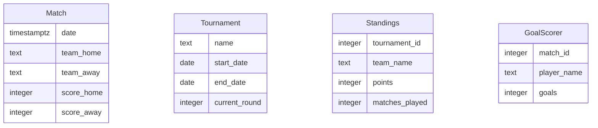

# Data Model

## ER Diagram

## Entity Descriptions

- **Match**: Represents a football match with details such as date, home and away teams, and scores.
- **Tournament**: Contains information about a football tournament, including its name, start and end dates, and the current round.
- **Standings**: Tracks the standings of teams in a tournament, including points and matches played.
- **GoalScorer**: Records information about players who scored goals in a match, including the number of goals.

## Relationships
- **Match** is associated with **GoalScorer** through `match_id`, indicating which players scored in a particular match.
- **Standings** is linked to **Tournament** via `tournament_id`, showing the standings for each tournament.