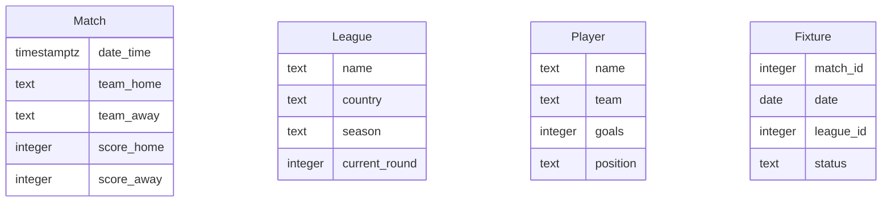

```mermaid
erDiagram
  Match {
    timestamptz date_time
    text team_home
    text team_away
    integer score_home
    integer score_away
  }
  League {
    text name
    text country
    text season
    integer current_round
  }
  Player {
    text name
    text team
    integer goals
    text position
  }
  Fixture {
    integer match_id
    date date
    integer league_id
    text status
  }
```