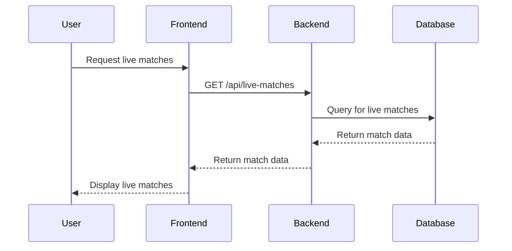
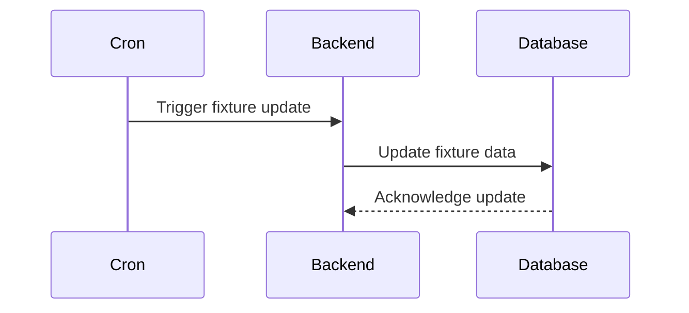
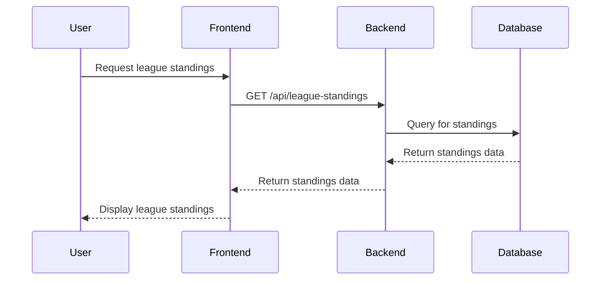

# Data Flows

## Key User/Data Flows

### Live Match Updates

```mermaid
sequenceDiagram
    participant User
    participant Frontend
    participant Backend
    participant Database

    User->>Frontend: Request live matches
    Frontend->>Backend: GET /api/live-matches
    Backend->>Database: Query for live matches
    Database-->>Backend: Return match data
    Backend-->>Frontend: Return match data
    Frontend-->>User: Display live matches
```

### Fixture Updates

```mermaid
sequenceDiagram
    participant Cron
    participant Backend
    participant Database

    Cron->>Backend: Trigger fixture update
    Backend->>Database: Update fixture data
    Database-->>Backend: Acknowledge update
```

### League Standings

```mermaid
sequenceDiagram
    participant User
    participant Frontend
    participant Backend
    participant Database

    User->>Frontend: Request league standings
    Frontend->>Backend: GET /api/league-standings
    Backend->>Database: Query for standings
    Database-->>Backend: Return standings data
    Backend-->>Frontend: Return standings data
    Frontend-->>User: Display league standings
```