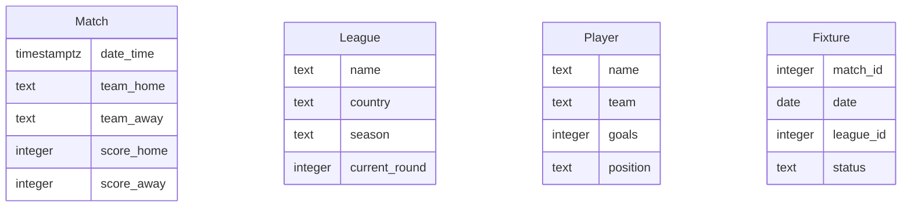

# Data Model

## ER Diagram

## Entity Descriptions

### Match
- **date_time**: The date and time when the match is scheduled or occurred.
- **team_home**: The home team participating in the match.
- **team_away**: The away team participating in the match.
- **score_home**: The score of the home team.
- **score_away**: The score of the away team.

### League
- **name**: The name of the league.
- **country**: The country where the league is based.
- **season**: The current season of the league.
- **current_round**: The current round of the league.

### Player
- **name**: The name of the player.
- **team**: The team the player belongs to.
- **goals**: The number of goals scored by the player.
- **position**: The position of the player on the field.

### Fixture
- **match_id**: The identifier for the match.
- **date**: The date the fixture is scheduled.
- **league_id**: The identifier for the league.
- **status**: The current status of the fixture (Scheduled, Ongoing, Completed).