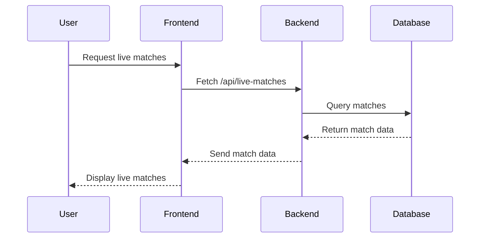
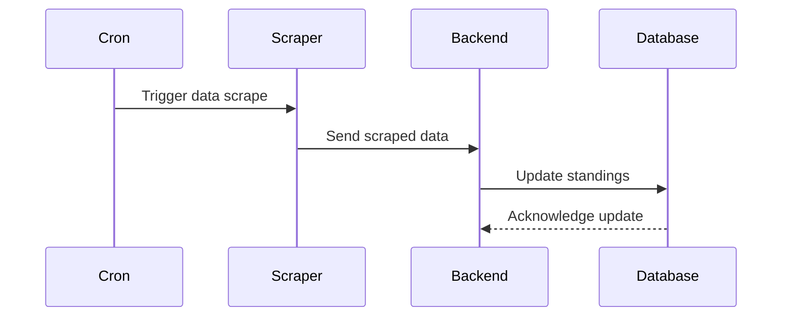
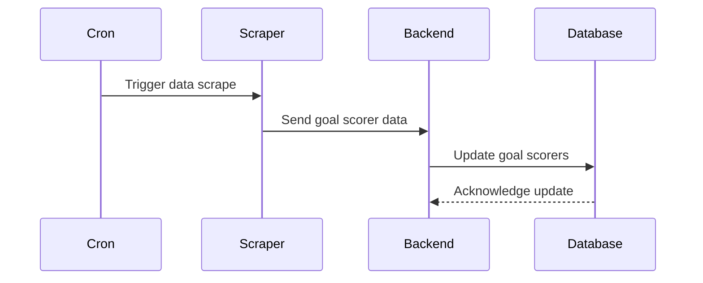

# Data Flows

## Live Match Data Flow

```mermaid
sequenceDiagram
    participant User
    participant Frontend
    participant Backend
    participant Database

    User->>Frontend: Request live matches
    Frontend->>Backend: Fetch /api/live-matches
    Backend->>Database: Query matches
    Database-->>Backend: Return match data
    Backend-->>Frontend: Send match data
    Frontend-->>User: Display live matches
```

## Standings Update Flow

```mermaid
sequenceDiagram
    participant Cron
    participant Scraper
    participant Backend
    participant Database

    Cron->>Scraper: Trigger data scrape
    Scraper->>Backend: Send scraped data
    Backend->>Database: Update standings
    Database-->>Backend: Acknowledge update
```

## Goal Scorer Update Flow

```mermaid
sequenceDiagram
    participant Cron
    participant Scraper
    participant Backend
    participant Database

    Cron->>Scraper: Trigger data scrape
    Scraper->>Backend: Send goal scorer data
    Backend->>Database: Update goal scorers
    Database-->>Backend: Acknowledge update
```