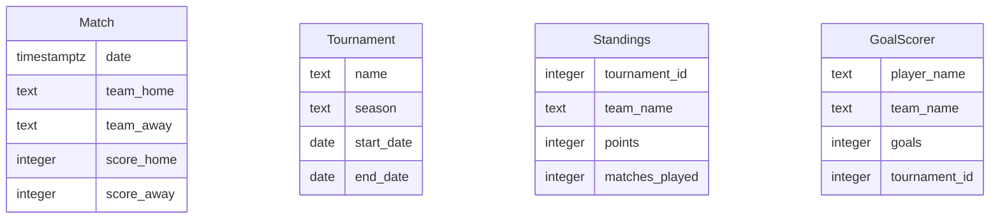

# Data Model

## ER Diagram

## Entity Descriptions
- **Match**: Represents a football match with details such as date, home and away teams, and scores.
- **Tournament**: Contains information about a football tournament, including its name, season, and start/end dates.
- **Standings**: Tracks the standings of teams within a specific tournament, including points and matches played.
- **GoalScorer**: Records the top scorers in a tournament, including player name, team, and number of goals.

## Relationships
- **Match** is related to **Tournament** through the tournament's schedule.
- **Standings** are associated with a specific **Tournament**.
- **GoalScorer** entries are linked to a **Tournament**.