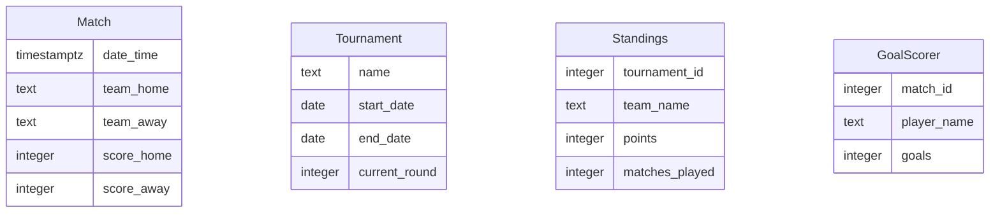

```mermaid
erDiagram
  Match {
    timestamptz date_time
    text team_home
    text team_away
    integer score_home
    integer score_away
  }
  Tournament {
    text name
    date start_date
    date end_date
    integer current_round
  }
  Standings {
    integer tournament_id
    text team_name
    integer points
    integer matches_played
  }
  GoalScorer {
    integer match_id
    text player_name
    integer goals
  }
```