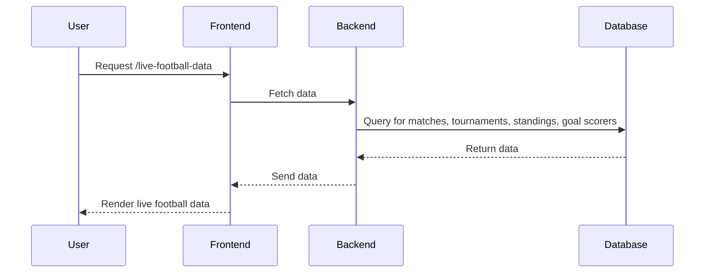
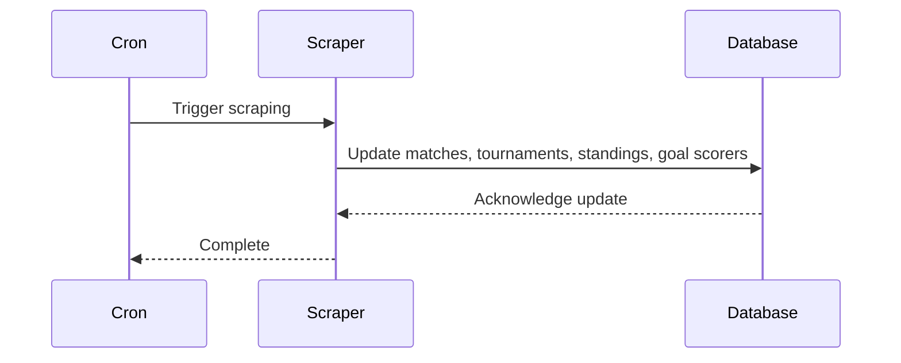

# Data Flows

## Key User/Data Flows

### Live Football Data Retrieval

```mermaid
sequenceDiagram
    participant User
    participant Frontend
    participant Backend
    participant Database

    User->>Frontend: Request /live-football-data
    Frontend->>Backend: Fetch data
    Backend->>Database: Query for matches, tournaments, standings, goal scorers
    Database-->>Backend: Return data
    Backend-->>Frontend: Send data
    Frontend-->>User: Render live football data
```

### Data Scraping and Update

```mermaid
sequenceDiagram
    participant Cron
    participant Scraper
    participant Database

    Cron->>Scraper: Trigger scraping
    Scraper->>Database: Update matches, tournaments, standings, goal scorers
    Database-->>Scraper: Acknowledge update
    Scraper-->>Cron: Complete
```