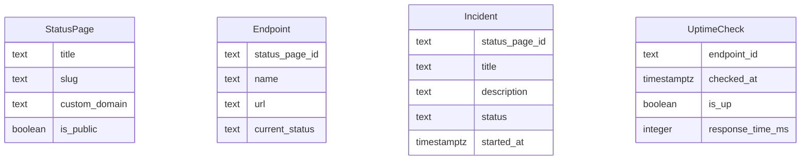

```mermaid
erDiagram
  StatusPage {
    text title
    text slug
    text custom_domain
    boolean is_public
  }
  Endpoint {
    text status_page_id
    text name
    text url
    text current_status
  }
  Incident {
    text status_page_id
    text title
    text description
    text status
    timestamptz started_at
  }
  UptimeCheck {
    text endpoint_id
    timestamptz checked_at
    boolean is_up
    integer response_time_ms
  }
```